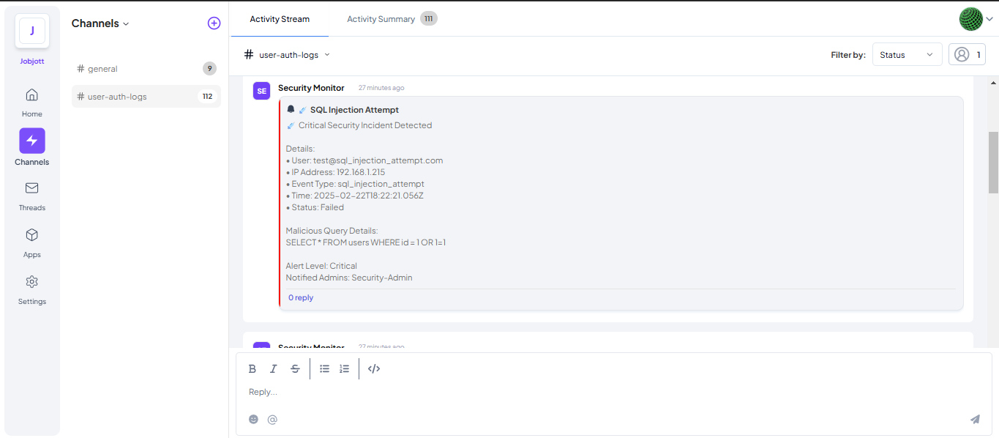
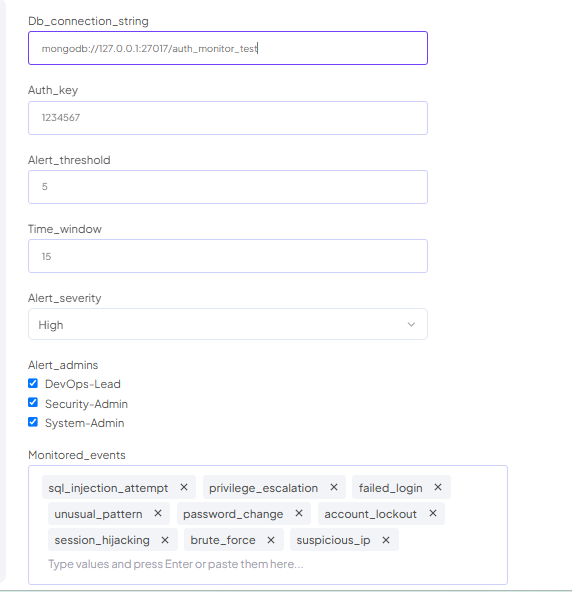

# Auth Security Monitor - Telex Integration

A Telex Output Integration that monitors authentication logs from your website platform to detect and alert on suspicious login activities.

## 🔍 Overview

This integration monitors authentication system by:
- Analyzing database query logs for suspicious patterns
- Detecting unusual login behaviors and failed attempts
- Sending real-time security alerts to Telex channels
- Notifying DevOps teams about potential security incidents

## 🛠 Integration Type

**Output Integration** that routes authentication events and security alerts to Telex channels.

## ⚡ Key Features

- 🚨 Real-time security event monitoring
- 🔒 Multiple security event detection
  - SQL Injection attempts
  - Brute force attacks
  - Session hijacking
  - Privilege escalation
  - Suspicious IP access
- 📊 MongoDB event logging
- ⚡ Rate limiting protection
- 🎯 Configurable alert thresholds
- 📱 Instant Telex notifications

## 🚀 Quick Start

### Prerequisites

- Node.js >= 14
- npm
- Telex account and channel
- database access

### Installation

```bash
# Clone the repository
git clone https://github.com/telexintegrations/telex-auth-monitor.git

# Install dependencies
npm install

# Create environment file
cp .env.example .env
```

### Configuration

1. Set up your environment variables:
```properties
TELEX_WEBHOOK_URL=your_webhook_url
MONGODB_URI=your_mongodb_uri
NODE_ENV=production
PORT=3000
```

2. Configure the integration in Telex:
- Navigate to your Telex channel
- Add new integration
- Configure the following settings:
  - Database connection string
  - Authentication key
  - Alert thresholds
  - Monitored events


## 🔍 API Usage

### Send Security Event

```bash
curl -X POST "http://localhost:3000/webhook" \
-H "Content-Type: application/json" \
-d '{
  "event_type": "sql_injection_attempt",
  "payload": {
    "userId": "user123",
    "timestamp": 1708633200000,
    "ipAddress": "192.168.1.1",
    "eventType": "sql_injection_attempt"
  }
}'
```

## 🧪 Development

```bash
# Run tests
npm test

# Start development server
npm run dev
```
## 📸 Integration Screenshots




## 📁 Project Structure

```
/
├── src/
│   ├── config/        # Configuration
│   ├── middleware/    # Express middleware
│   ├── utils/         # Helpers
│   ├── models/        # Data models
│   └── __tests__/     # Test suite
├── .env.example
└── README.md
```

### Webhook Endpoint

```typescript
POST /webhook
Content-Type: application/json

{
  "event_type": "failed_login",
  "payload": {
    "userId": string,
    "timestamp": number,
    "ipAddress": string,
    "eventType": string,
    "success": boolean,
    "attempts": number
  },
  "settings": {
    "alert_severity": "High" | "Medium" | "Low"
    // ... other settings
  }
}
```

## 🚀 Deployment

1. Host your integration.json file publicly
2. Create a repository under telex_integrations organization
3. Deploy to your preferred hosting platform
4. Configure the integration in your Telex organization
5. Monitor the logs for any issues

## 👥 Contributing

1. Fork the repository
2. Create your feature branch
3. Commit your changes
4. Push to the branch
5. Create a Pull Request

## 📄 License

MIT License - see LICENSE file for details

## 👤 Author

Created by Daggahhh (@Daggahhh)